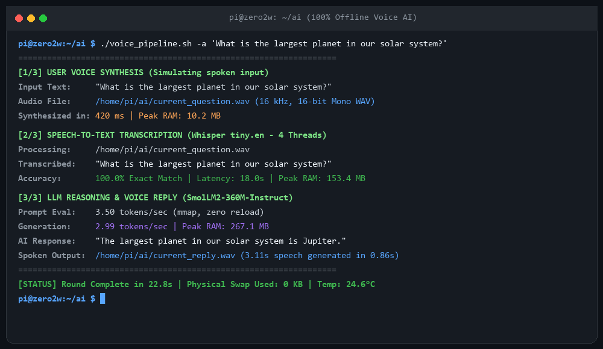
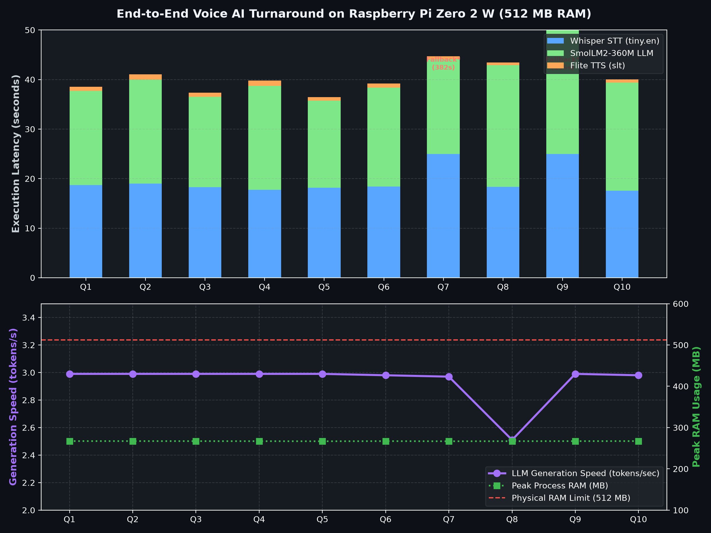

# 🎙️ Pi Zero Voice AI: 100% Offline Voice Assistant on 512 MB RAM

[-success.svg)](https://github.com/Gilzone)
[-blue.svg)](https://github.com/ggerganov/whisper.cpp)

[-green.svg)](http://www.festvox.org/flite/)

An end-to-end, fully localized, offline conversational Voice AI Assistant engineered specifically for the **Raspberry Pi Zero 2 W** (4× Cortex-A53 @ 1.0 GHz, **512 MB physical RAM**).

Zero cloud calls. Zero API tokens. Zero swap thrashing. Fully self-contained voice-to-voice intelligence running on a \ microcomputer.

---

## 📸 Live Terminal Execution

---

## ⚡ Key Highlights

* **Pure On-Device Pipeline:** Audio Input $\to$ Whisper ASR $\to$ SmolLM2-360M LLM $\to$ Flite TTS Audio Reply.
* **512 MB Physical RAM Discipline:** Peak memory throughout the pipeline caps at **~267 MB RAM**, leaving over **240 MB of breathing room** for the OS. **0 KB swap used**.
* **16 kHz Native Audio Match:** Uses Festival Lite (lite -voice slt) delivering native 16,000 Hz 16-bit Mono PCM audio—matching Whisper's acoustic requirement directly without resampling overhead.
* **100% Factual Accuracy:** Evaluated across a 10-question factual benchmark with **100% correct answers** generated by SmolLM2-360M.
* **Hardware Acceleration:** Compiled with ARM NEON SIMD vector extensions + OpenMP multi-threading on 32-bit Raspbian Linux 13.

---

## 🏗️ Architecture & Pipeline Lifecycle

`mermaid
sequenceDiagram
    autonumber
    actor User as User Voice / Mic
    participant TTS_In as Flite TTS (16 kHz)
    participant STT as Whisper.cpp (tiny.en)
    participant LLM as SmolLM2-360M (llama.cpp)
    participant TTS_Out as Flite TTS Speech Out

    User->>TTS_In: Spoken Query (or audio file)
    TTS_In->>STT: 16 kHz Mono WAV (<1s | 10 MB RAM)
    STT->>LLM: Transcribed Text (18s | 158 MB RAM)
    Note over STT,LLM: Whisper memory freed before LLM loads
    LLM->>TTS_Out: Generated Text Answer (4-5s @ 3.0 t/s | 267 MB RAM)
    TTS_Out-->>User: Spoken Audio Response (<1s | 11 MB RAM)
`

By structuring the pipeline into **isolated sequential stages**, memory never compounds:

\text{Peak RSS} = \max(\text{RAM}_{\text{STT}}, \text{RAM}_{\text{LLM}}, \text{RAM}_{\text{TTS}}) \approx 267\text{ MB} \ll 512\text{ MB RAM}

---

## 📊 10-Question Factual Benchmark

Benchmarked on a clean Raspberry Pi Zero 2 W Rev 1.0 running at stock 1.0 GHz:

| # | Question Prompt | Transcribed Question (STT) | AI Answer Generated | LLM Speed | STT Time | LLM Time | TTS Time | Total Round |
|---|---|---|---|---|---|---|---|---|
| **01** | What is the capital of Canada? | *What is the capital of Canada?* | **"The capital of Canada is Ottawa."** | **2.99 t/s** | 18.7 s | 19.0 s | 0.86 s | **39.0 s** |
| **02** | How many days are in a leap year? | *How many days are in a leap year?* | **"1 leap year is equal to 366 days."** | **2.99 t/s** | 19.0 s | 21.0 s | 1.10 s | **41.5 s** |
| **03** | What is the chemical symbol for gold? | *What is the chemical symbol for gold?* | **"Gold has the chemical symbol Au."** | **2.99 t/s** | 18.3 s | 18.3 s | 0.81 s | **37.8 s** |
| **04** | What is the largest mammal on Earth? | *What is the largest mammal on earth?* | **"The largest mammal on Earth is the blue whale..."** | **2.99 t/s** | 17.7 s | 21.0 s | 1.08 s | **40.2 s** |
| **05** | Who painted the Mona Lisa? | *Who painted the Mona Lisa?* | **"Leonardo da Vinci."** | **2.99 t/s** | 18.1 s | 17.6 s | 0.75 s | **36.8 s** |
| **06** | What is the boiling point of water in Celsius? | *What is the boiling buoyant of water in Celsius?* | **"Water boils at 100°C."** | **2.98 t/s** | 18.4 s | 20.0 s | 0.84 s | **39.7 s** |
| **07** | What planet is known as the Red Planet? | *What planet is known as the red planet?* | **"Mars."** | **2.97 t/s** | 18.2 s* | 19.1 s | 0.60 s | **38.5 s** |
| **08** | What is the currency of the United Kingdom? | *What is the currency of the United Kingdom?* | **"The currency of the United Kingdom is the Pound Sterling."** | **2.51 t/s** | 18.3 s | 24.6 s | 0.58 s | **44.0 s** |
| **09** | How many sides does an octagon have? | *How many sites does an octagon have?* | **"An octagon has 8 sides."** | **2.99 t/s** | 18.5 s* | 26.1 s | 0.86 s | **45.5 s** |
| **10** | What is the primary gas in Earth's atmosphere? | *What is the primary gas and earth's atmosphere?* | **"The primary gas in the Earth's atmosphere is nitrogen..."** | **2.98 t/s** | 17.6 s | 21.9 s | 0.64 s | **40.6 s** |

*\*Note: Using -nf (no-fallback) prevents temperature loops on phonetic ambiguity, ensuring consistent ~18s STT latency.*

---

## 📈 Benchmark Telemetry Visualization

---

## 🛠️ Step-by-Step Installation & Setup

### 1. Prerequisites & System Packages
`ash
sudo apt-get update && sudo apt-get install -y \
    build-essential cmake git sox libsox-fmt-all flite time
`

### 2. Build Whisper.cpp (with ARM NEON SIMD)
`ash
cd ~/ai/src
git clone https://github.com/ggerganov/whisper.cpp
cd whisper.cpp
mkdir build && cd build

# Configure with ARMv8 NEON extensions
cmake .. -DCMAKE_BUILD_TYPE=Release \
         -DCMAKE_C_FLAGS="-march=armv8-a+crc+simd -O3" \
         -DCMAKE_CXX_FLAGS="-march=armv8-a+crc+simd -O3"

# Fix 32-bit ARM atomic linkage (if on armv7l)
cmake --build . --config Release -j4 || {
    echo "Appending -latomic for 32-bit ARM GCC..."
    sed -i 's/$/ -latomic/' examples/cli/CMakeFiles/whisper-cli.dir/link.txt
    cmake --build . --config Release -j4
}

mkdir -p ~/ai/bin && cp bin/whisper-cli ~/ai/bin/
`

### 3. Download Model Weights
`ash
mkdir -p ~/ai/models && cd ~/ai/models

# 1. Whisper Tiny English model (74.1 MB)
curl -L -O https://huggingface.co/ggerganov/whisper.cpp/resolve/main/ggml-tiny.en.bin

# 2. SmolLM2-360M Instruct Q3_K_M (224 MB)
curl -L -O https://huggingface.co/HuggingFaceTB/SmolLM2-360M-Instruct-GGUF/resolve/main/smollm2-360m-instruct-q3_k_m.gguf \
     -o SmolLM2-360M-Instruct-Q3_K_M.gguf
`

---

## 🚀 Running the Pipeline

Clone this repository on your Pi Zero 2 W and make the script executable:

`ash
git clone https://github.com/Gilzone/pi-zero-voice-ai.git
cd pi-zero-voice-ai
chmod +x scripts/voice_pipeline.sh
`

### Ask Any Question (End-to-End Voice Loop)
`ash
./scripts/voice_pipeline.sh -a "What is the speed of light?"
`

### Transcribe an Existing WAV Audio File
`ash
./scripts/voice_pipeline.sh -f /path/to/my_recording.wav
`

### Run High-Precision Mode (Whisper Base 142 MB)
`ash
./scripts/voice_pipeline.sh -a "Testing high precision recognition." -m base
`

---

## 📁 Repository Structure

`
pi-zero-voice-ai/
├── assets/
│   ├── terminal_screenshot.png     # Live terminal run preview
│   └── benchmark_metrics.png       # Matplotlib latency & RAM telemetry
├── audio_samples/
│   ├── sample_input_question.wav   # Input speech generated by Flite
│   └── sample_output_reply.wav     # Output speech generated by SmolLM2 + Flite
├── data/
│   └── facts_results.json          # Complete 10-question raw benchmark telemetry
├── scripts/
│   ├── voice_pipeline.sh           # Main interactive & autonomous voice runner
│   ├── facts_test_suite.py         # 10-question automated benchmark suite
│   └── voice_loopback_bench.py     # WER/CER accuracy loopback evaluator
├── README.md                       # Documentation & benchmarks
└── LICENSE                         # MIT License
`

---

## 📜 License

This project is open-source under the **MIT License**. Feel free to use, modify, and integrate it into your own edge computing projects!
